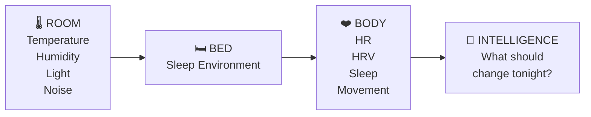
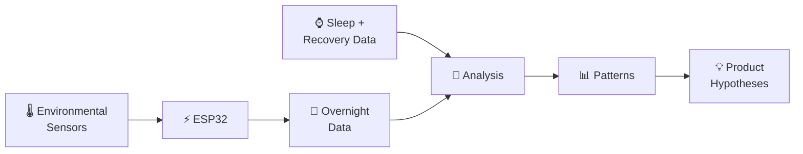
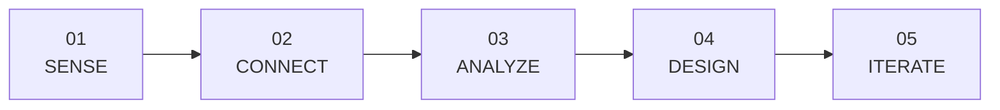
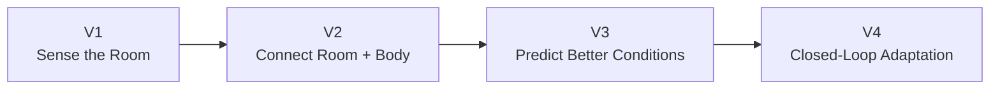

# Beyond the Bed

> How can environmental sensing help a sleep system understand not only the person in the bed, but the environment around them?

**Beyond the Bed** is a personal N-of-1 hardware, software, and human-performance case study exploring how bedroom conditions interact with sleep and recovery.

The project combines environmental sensing with personal sleep data to explore whether context **beyond the bed** could help create more adaptive sleep experiences.

---

## Observation

Sleep does not happen in isolation.

Temperature, humidity, light, noise, and air quality continuously change around us throughout the night. Yet these signals are often disconnected from the physiological data we use to understand sleep.

This raised a simple question:

> **What could a sleep system learn by understanding the room as well as the person?**



---

## Project Goal

Build a simple environmental sensing system to:

* Measure bedroom conditions throughout the night
* Connect environmental and physiological data
* Identify patterns associated with sleep and recovery
* Explore environmental context as an input for personalization
* Translate observations into future product experiments

---

## System



### Environmental Signals

* Temperature
* Humidity
* Ambient light
* Noise
* Air quality / CO₂

### Human Signals

* Sleep duration
* Sleep interruptions
* Heart rate
* HRV
* Recovery
* Personal sleep notes

---

## Approach



**01 · Sense**
Build a low-cost bedroom sensor and capture environmental conditions throughout the night.

**02 · Connect**
Align environmental measurements with sleep and recovery data.

**03 · Analyze**
Explore how changes in the room correspond with changes in sleep.

**04 · Design**
Translate observations into hypotheses for a more context-aware sleep system.

**05 · Iterate**
Identify what sensors, experiments, and control systems would make the next version more useful.

---

## Product Exploration

Today, personalization can largely be thought of as:

```text
BODY → DATA → PERSONALIZATION
```

Beyond the Bed explores another layer:

```text
        ROOM
          ↓
BODY → CONTEXT → INTELLIGENCE → ADAPTATION
          ↑
         BED
```

The long-term question is not simply:

> **How did I sleep?**

It is:

> **What was happening around me while I slept, how did my body respond, and what could the system do differently next time?**

---

## Build → Learn → Adapt



**Beyond the Bed** is an exploration of what happens when the bedroom itself becomes another source of intelligence.

