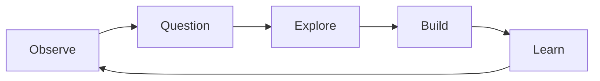

# SpecialProjects

A collection of experiments, questions, ideas, and things I wanted to explore.

Some projects begin with a problem.  
Others begin with an observation, a curiosity, or a simple question.

Some may become products.  
Some may remain experiments.  
All are built to learn something.

---

## Process

## Project Framework

Each project follows a simple structure:

Observation
- What did I notice?

Question
- What am I trying to understand?

Method
- How will I explore it?

Artifact
- What can I build, test, or document?

Insight
- What did I learn, and what should happen next?
